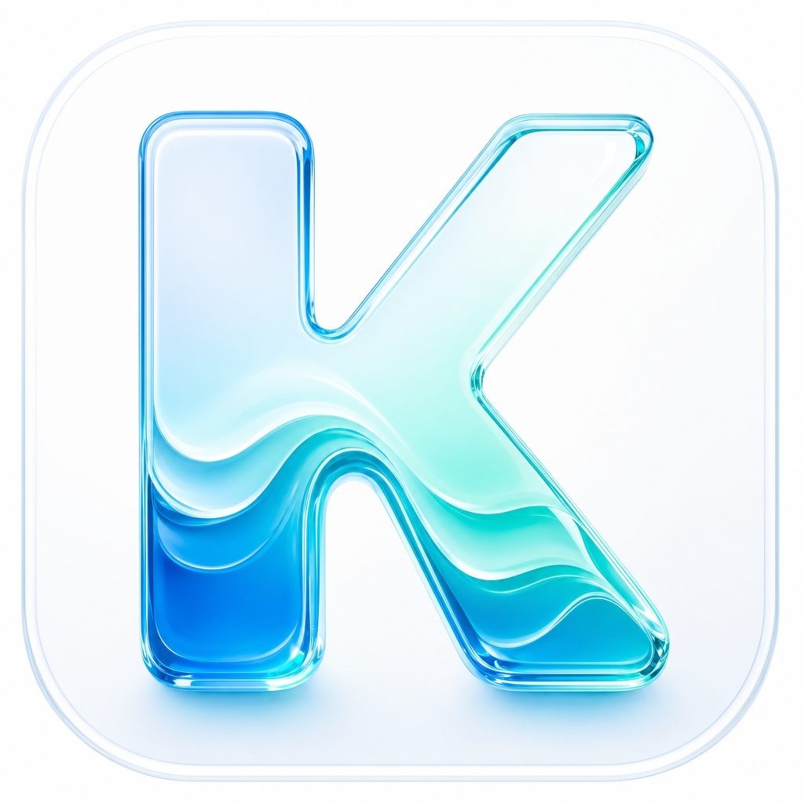

# Kreasea — AI Content Studio

### Platform konten bertenaga AI untuk UMKM Indonesia 🇮🇩

---

## ✨ Tentang Kreasea

**Kreasea** adalah aplikasi AI Content Studio yang dirancang khusus untuk membantu pelaku **UMKM Indonesia** membuat konten media sosial yang menarik, profesional, dan relevan — dalam hitungan detik.

Tidak perlu jadi desainer atau copywriter handal. Cukup masukkan informasi produk kamu, dan Kreasea akan menghasilkan caption, gambar, dan strategi konten yang siap diposting.

---

## 🚀 Fitur Unggulan

### 🤖 AI Caption Generator
Buat 3 variasi caption sekaligus untuk setiap postingan — dengan pendekatan **Emotional**, **Informative**, dan **Storytelling**. Mendukung berbagai platform:
- Instagram, TikTok, Facebook, Twitter/X
- Tone yang dapat dikustomisasi (profesional, kasual, humor, inspiratif)
- Support emoji, hashtag otomatis, dan call-to-action

### 🎨 AI Image Generator
Hasilkan gambar produk dan konten visual berkualitas tinggi menggunakan Stability AI SDXL. Cukup deskripsikan ide kamu dalam bahasa Indonesia — Kreasea otomatis mengubahnya menjadi prompt profesional yang dipahami AI.

### 📊 Analisis HPP & Harga
Kalkulator Harga Pokok Penjualan cerdas yang memberikan rekomendasi harga jual optimal, analisis margin, dan strategi penetapan harga berdasarkan data bisnis nyata.

### 📅 Jadwal Konten
Rencanakan dan kelola jadwal posting media sosial dengan kalender konten mingguan dan bulanan. Tidak ada lagi konten yang terlupakan.

### 📚 Library Konten
Simpan semua hasil generate — caption maupun gambar — dalam satu tempat yang terorganisir. Mudah dicari, disalin, dan digunakan kembali.

### 📈 Dashboard Analitik
Pantau performa konten dan statistik bisnis dalam satu tampilan ringkas yang mudah dipahami.

---

## 💎 Sistem Kredit Harian

Setiap user mendapatkan kredit harian yang otomatis diperbarui setiap tengah malam WIB:

| Plan | 🖼️ Generate Gambar | ✍️ Generate Caption |
|------|:---:|:---:|
| **Free** | 3/hari | 5/hari |
| **Pro** | 15/hari | 25/hari |
| **Premium** | 50/hari | 99/hari |

---

## 🤖 Teknologi AI

Kreasea menggunakan sistem **Multi-Key AI Orchestration** yang canggih:

- **5 Gemini API Key** dengan rotasi otomatis — jika satu key mencapai limit, sistem langsung beralih ke key berikutnya tanpa interupsi
- **OpenAI GPT-4o-mini** sebagai fallback — jika semua Gemini key sedang penuh
- **Stability AI SDXL** untuk generasi gambar berkualitas tinggi
- **Smart Prompt Engine** — prompt yang dioptimalkan khusus untuk konteks UMKM Indonesia

---

## 🎨 Desain

Kreasea mengusung estetika **glassmorphism** modern dengan:
- Dark mode sebagai tampilan utama
- Gradient ungu-indigo yang elegan
- Animasi halus dan transisi yang smooth
- Layout yang responsif untuk berbagai ukuran layar Android

---

## 🔐 Keamanan

- Autentikasi Firebase (Email/Password & Google Sign-In)
- API key tidak tersimpan di client — semua dikelola di sisi server
- Firestore security rules memastikan setiap user hanya bisa akses data miliknya
- Sistem kredit berbasis Firestore yang aman dari manipulasi

---

## 📱 Screenshot

> *Tampilan aplikasi mencakup Splash Screen animatif, Dashboard UMKM, AI Caption Studio, AI Image Generator, Library, Kalender Konten, dan Pengaturan.*

---

**Dibuat dengan ❤️ untuk UMKM Indonesia**

*Kreasea — Konten Terbaik, Dibuat AI, Dipercaya Bisnis Lokal*

